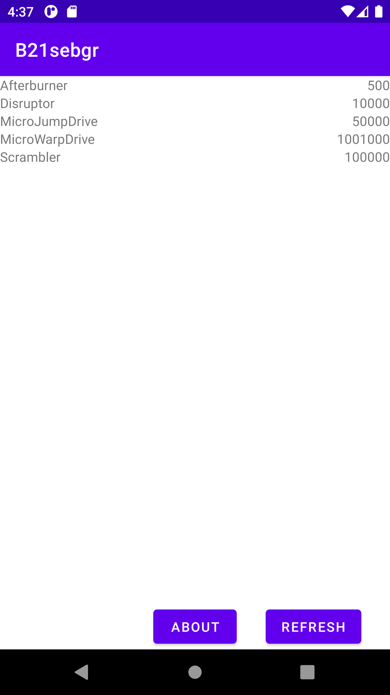

# Rapport

Jag gjorde en app som hämtar in data från nätet med json och varje item i listan visar namnet och 
snittpriset på varje sak, klicka på refresh för att hämta ner informationen från nätet igen,
aboutknappen startar en ny aktivitet med lite text om vem appen är gjord för och för att komma 
tillbaka till huvudskärmen så är det bara att klicka på tillbakaknappen på telefonen

```
        aboutButton = findViewById(R.id.about_button);
        refreshButton = findViewById(R.id.refresh_button);
        aboutButton.setOnClickListener(new View.OnClickListener() {
            @Override
            public void onClick(View view) {
                Intent intent = new Intent(MainActivity.this, AboutActivity.class);
                startActivity(intent);
            }
        });
        refreshButton.setOnClickListener(new View.OnClickListener() {
            @Override
            public void onClick(View view) {
                refresh();
            }
        });

        listView = findViewById(R.id.list_view);
        adapter = new ListAdapter(new ArrayList<Item>());
        listView.setAdapter(adapter);
        listView.setLayoutManager(new LinearLayoutManager(getApplicationContext()));
        refresh();
```

